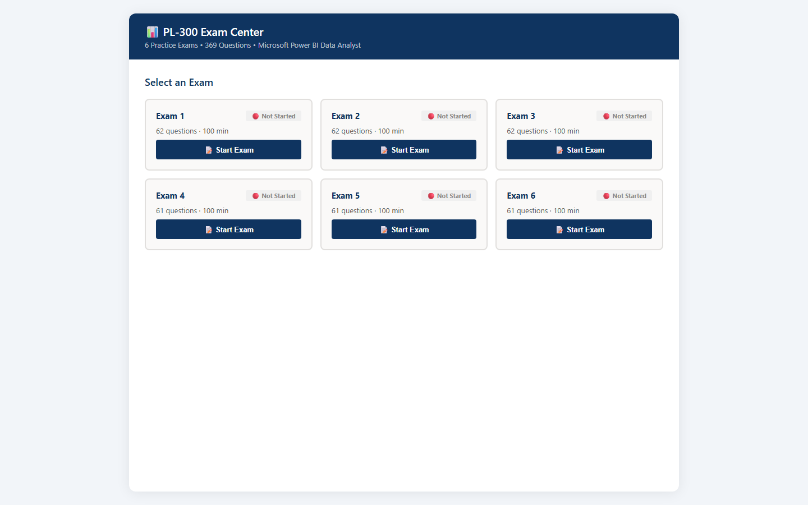
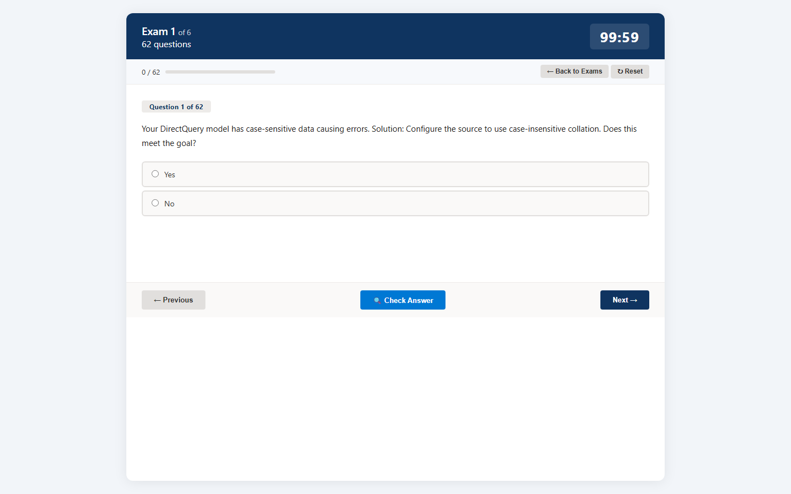

# PL-300 Exam Center

> Practice exams for Microsoft PL-300: Power BI Data Analyst certification — 369 questions across 6 exams with instant feedback and verified answer corrections.

<p align="center">
  
  
  
  
  
  
</p>

---

## Quick Start

1. Extract the `PL300-Portable.zip` anywhere on any Windows PC
2. Double-click `PL300.exe` (or `run.bat`)
3. Open http://localhost:9090 in your browser

**No Python, no dependencies, no installation required.**

---

## Features

| | Feature | Description |
|---|---|---|
| :alarm_clock: | **Timed Exams** | 60-minute countdown per exam — auto-submit when time runs out |
| :white_check_mark: | **Check Answer** | Instant per-question feedback with correct answer and explanation |
| :bookmark: | **Flag for Review** | Mark questions you want to revisit before submitting |
| :bar_chart: | **Progress Tracking** | Visual progress bar showing answered vs. unanswered questions |
| :hand: | **Drag & Drop** | Native support for "choose the correct order" question types |
| :1234: | **Score Summary** | Final result page with percentage, pass/fail, and per-question review |
| :pencil: | **Answer Corrections** | 7 community-verified corrections baked in, sourced from Microsoft Learn |

---

## Screenshots

| Dashboard | Exam Page |
|---|---|
|  |  |

---

## Portfolio Structure

```
PL-300 Exam Center/
├── data/
│   ├── exam_1.json ... exam_6.json   369 PL-300 practice questions
│   └── corrections.json              7 verified answer overrides
├── templates/
│   ├── dashboard.html                exam selection homepage
│   └── exam.html                     exam-taking interface
├── static/
│   └── style.css                     all styling
├── screenshots/                      README screenshots
├── _internal/                        Python runtime + dependencies
├── main.py                           FastAPI application source
├── PL300.exe                         standalone executable (no Python needed)
├── run.bat                           launcher script
└── run.py                            source launcher (requires Python)
```

---

## Answer Corrections

Seven questions verified against Microsoft Learn documentation:

| Exam | # | Type | Original | Correct | Question Summary |
|---|---|---|---|---|---|
| 1 | 16 | mc | C | **B** | Pixel-perfect printable report type |
| 2 | 19 | mc | C | **B** | Analyze Power BI dataset in Excel |
| 3 | 18 | mc | C | **B** | Apply multiple bookmarks together |
| 3 | 56 | mc | C | **B** | Multiple color thresholds for a column |
| 5 | 23 | hs | AC | **AB** | Card vs. KPI visual selection |
| 6 | 53 | mc | D | **C** | Column Quality metric meaning |
| 6 | 61 | mc | D | **C** | Drillthrough with Region context |

> Corrections applied at runtime via `corrections.json` — original exam JSON files remain untouched.

---

## Tech Stack

<p align="center">
  
  
  
  
  
  
  
  
</p>

---

## Development

If you have Python 3.10+ installed:

```bash
python -m venv venv
venv\Scripts\pip install -r requirements.txt
venv\Scripts\python run.py
```

Or use Docker:

```bash
docker compose up -d
```

---

## License

MIT — free to use, modify, and share.
